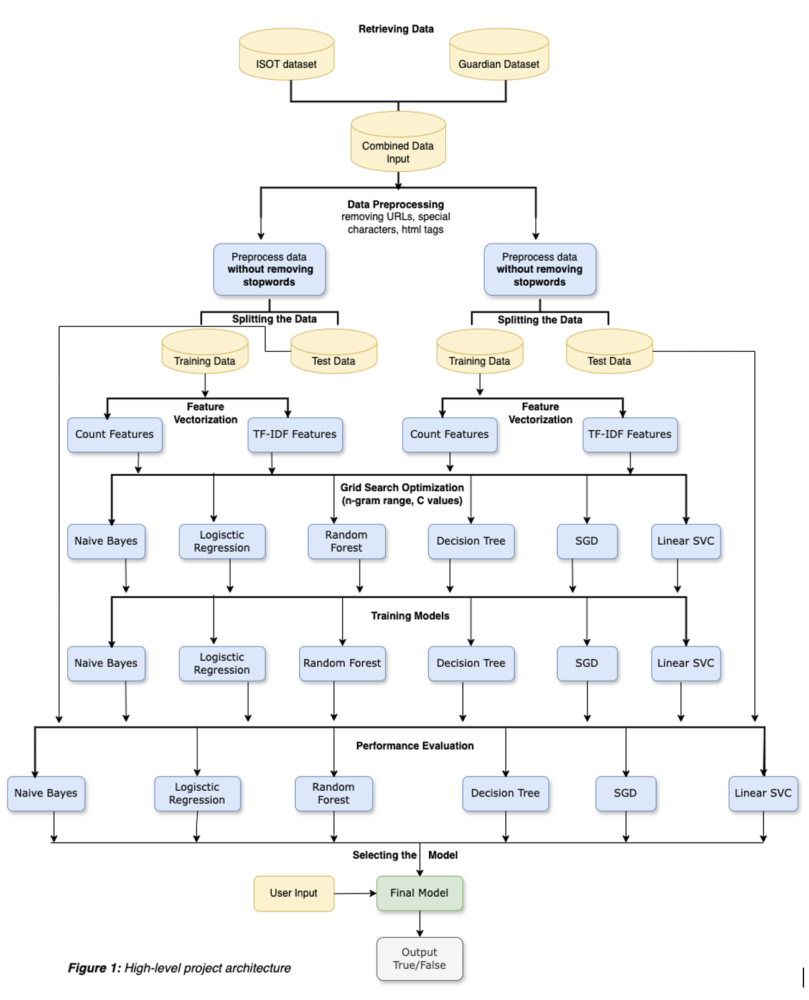

## University of London
## CM3070 Final Project (Natural Language Processing)  
# Fake News Detection

## This project aims to design, implement, and evaluate several classifiers to compare their performances in the task of detecting fake news. 

## Model Architecture

### The Repository Details

- 'data' folder contains the datasets used for training ML models.
- 'helpers.py' file contains all custom made functions for the project.
- 'fake_news_detection_final_project.ipynb' file contains EDA, implementation of several classifiers and evaluation results.

## License

Distributed under the [**MIT License**](LICENSE). 